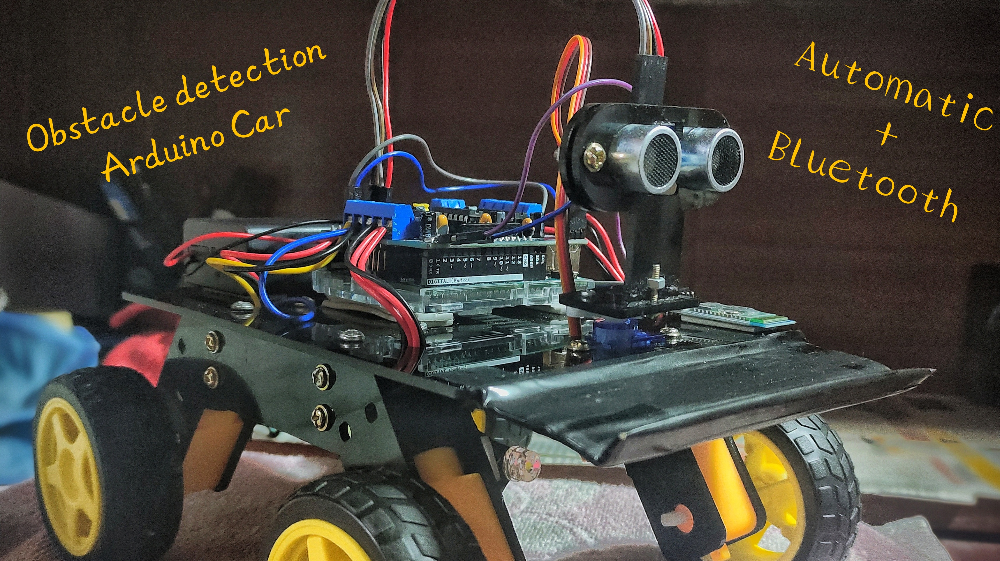

## 🚗 Arduino Robot Car with Bluetooth Control + Obstacle Avoidance

This project is a 4-wheel robot car built using an **Arduino**, **Adafruit Motor Shield**, **ultrasonic sensor**, and a **servo** for scanning. The robot operates in multiple modes using Bluetooth commands sent from a mobile app.

---

### 📱 Bluetooth Control via Mobile App
I used the **“Arduino Bluetooth Controller” app (v1.7)** from the Google Play Store to control the car.  
The app sends **customized characters** through Bluetooth, such as:

- `A` – Normal Bluetooth control  
- `O` – Emergency Stop mode  
- `T` – Bluetooth + Obstacle Avoidance  
- `X` – Stop  
- `F` – Forward  
- `B` – Backward  
- `L` – Turn Left  
- `R` – Turn Right  
- `S` – Stop  

The Arduino receives these commands through an HC-05/HC-06 Bluetooth module and controls the robot accordingly.

---

### ✨ Main Features

#### **1. Manual Bluetooth Control**
The robot responds to:
`F`, `B`, `L`, `R`, and `S` for direction and stopping.

#### **2. Ultrasonic Obstacle Detection**
A servo-mounted ultrasonic sensor rotates left and right to measure distances and detect obstacles.

#### **3. Obstacle Avoidance Mode**
When an obstacle is detected:
- The robot stops  
- Moves backward slightly  
- Scans left & right  
- Turns toward the direction with more space  
- Continues moving forward  

#### **4. Emergency Stop Mode**
Automatically stops and backs away if an object gets too close—even during manual Bluetooth control.

#### **5. Combined Mode**
Allows Bluetooth control while still enabling automatic obstacle avoidance.

---

## Demo Video:

---

### 🔧 How It Works
- Four DC motors are controlled through the **Adafruit Motor Shield**.  
- The ultrasonic sensor calculates distance using echo timing.  
- A servo rotates the sensor to scan at multiple angles (20°, 103°, 180°).  
- The main loop checks the selected mode and executes the appropriate movement logic.
